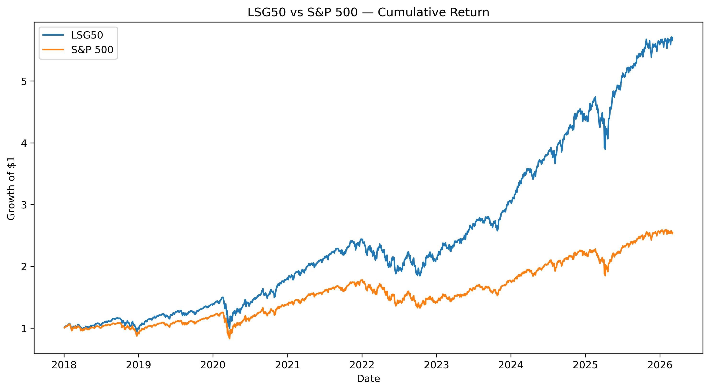

# Corporate Financial Health Index (CFHI)

Índice cuantitativo diseñado para identificar empresas financieramente sólidas dentro del universo del S&P 500 utilizando métricas fundamentales.

El proyecto construye un índice basado en salud financiera corporativa y evalúa su rendimiento histórico frente al S&P 500.

---

## Metodología

El índice se construye a partir de cuatro dimensiones financieras clave:

- **Rentabilidad**
- **Solvencia**
- **Liquidez**
- **Crecimiento**

Cada empresa recibe un **score financiero agregado** y se seleccionan las **50 empresas mejor clasificadas** para formar el índice.

---

## Pipeline del proyecto

El flujo de trabajo sigue las siguientes etapas:

1. Extracción de datos financieros desde una API
2. Limpieza y transformación de datos
3. Cálculo de métricas financieras
4. Construcción del índice
5. Backtest histórico
6. Análisis del rendimiento

---

## Estructura del proyecto

El proyecto está organizado en distintos módulos que representan cada etapa del pipeline de datos.

CFHI_Project

- data_raw:
  
   .datos financieros descargados desde la API

- notebooks:

  
  . 01_api_extraction.ipynb → extracción de datos
  
  . 02_pipeline_clean.ipynb → limpieza y transformación
  
  . 03_pipeline_build.ipynb → construcción del índice
  
  . 04_lsg50_backtest.ipynb → backtest histórico
  
  . 05_lsg50_index_research.ipynb → análisis del índice
  
  .06_project_architecture.ipynb → documentación del pipeline

- src:
  
  .functions.py
  
  .fundamentals.py

- sql:
  
 .schema.sql

- tableau:
  
 .visualizaciones del índice

---

## Resultados del backtest

Comparación del rendimiento del índice frente al S&P 500.

---

## Tecnologías utilizadas

- Python
- pandas
- numpy
- matplotlib
- yfinance
- SQLite
- Tableau

---

## Autor

Lautaro Silvestri  
Proyecto final — Data & Financial Analytics
